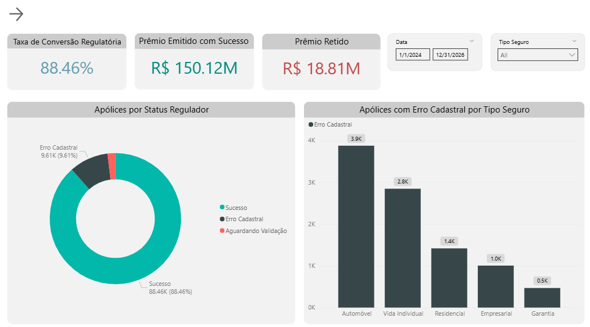

# Dashboard de Compliance Regulatório e Saneamento SRO (SUSEP)



Um projeto de Business Intelligence de ponta a ponta voltado para o setor de seguros. O objetivo principal é automatizar a auditoria, o saneamento e a análise de dados regulatórios antes do envio definitivo das apólices para o SRO (Sistema de Registro de Operações) da SUSEP, utilizando Python para engenharia de qualidade de dados e Power BI para modelagem multidimensional (DAX).

---

## Arquitetura de Dados & Pipeline

```text
[Base em Excel Corrompida] ➔ [Saneamento de Dados com Python/Pandas] ➔ [Modelo Star Schema no Power BI]
```

1. **Extração & Engenharia de Qualidade (Python/Pandas):** 
   * Extração de bases operacionais de seguros contendo erros sistemáticos de digitação e falhas de integração do sistema de origem.
   * Desenvolvimento de scripts em Python no VS Code utilizando **Pandas** para corrigir de forma programática campos estruturais quebrados (CPFs ausentes e métricas de inteligência temporal invertidas).
2. **Modelagem de Dados (Star Schema):**
   * Estruturação de um modelo dimensional robusto e de alta performance (Star Schema) dentro do Power BI para garantir a integridade dos filtros cruzados e precisão analítica.


*   **Tabela Fato:** `fSRO_Analysis` / `fApolices_SRO` (Transações de apólices, prêmios emitidos e códigos de status regulatório).
*   **Tabelas Dimensão:** `dStatus_Regulador`, `dSeguro_Ramo` e uma tabela dinâmica de tempo `dCalendar` criada via DAX.

---

## O Script Python (Saneamento de Dados)

No mercado real de seguros, os sistemas de origem frequentemente geram dados cadastrais ausentes ou mal formatados. O script abaixo identifica e padroniza as entradas vazias de forma programática para garantir o rastreamento operacional. Antes de usar foi convertido para o formato .parquet, assim melhorando a leitura do sistema perante o arquivo:

```python
import pandas as pd

# Carregar a base de dados bruta de seguros
df = pd.read_parquet("SRO_Project/files/df.parquet.gzip")

# Essa função como o próprio nome diz serve para fazer a limpeza dos dados
def data_cleaner():
    df['CPF_Cliente'] = df['CPF_Cliente'].fillna("CPF Não informado")
    df.dropna(subset='ID_Apolice')

# Essa função troca o formato dos dados para manter a otimização do dataframe
def dtype_changer():
    df['ID_Apolice'] = df['ID_Apolice'].astype('string')
    df['Ramo_Seguro'] = df['Ramo_Seguro'].astype('category')
    pd.to_datetime(df['Data_Inicio_Vigencia'], format="mixed", dayfirst=True)
    pd.to_datetime(df['Data_Fim_Vigencia'], format="mixed", dayfirst=True)
    df['CPF_Cliente'] = df['CPF_Cliente'].astype('string')
    df['Status_Regulador'] = df['Status_Regulador'].astype('category')

# Essa função por fim serve para renomear as colunas para o mesmo do banco de dados para então enviar os dados
def column_rename():
    df.rename(columns={"ID_Apolice":"police_id","Ramo_Seguro":"insurance_type","Data_Inicio_Vigencia":"start_date",
                            "Data_Fim_Vigencia":"end_date","Valor_Premio_R$":"premium_account",
                            "Valor_Segurado_R$":"coverage_amount","CPF_Cliente":"client_cpf","Status_Regulador":"claim_status"}, inplace=True)

#Essa função eu usei apenas uma vez para saber quais são as Ápolices e separá-las para então enviar uma lista para o TI
def missing_apolice_df():
    missing_apolices = df.loc[df['ID_Apolice'] == '',['Ramo_Seguro','CPF_Cliente','Data_Inicio_Vigencia',
                                                      'Data_Fim_Vigencia','Valor_Premio_R$',
                                                      'Valor_Segurado_R$','Status_Regulador']]
    missing_apolices.to_csv("missing_apolices.csv",index=False,encoding="utf-8")

dtype_changer()
data_cleaner()
column_rename()
```

**Lógica do Script & Impacto no Negócio:**
1. **Tratamento de Cadastros Nulos:** Apólices de seguro não podem ser transmitidas à SUSEP sem um documento válido. O script varre a coluna `CPF_Cliente` e substitui valores nulos pela tag de rastreio (`"CPF Não Informado"`).
2. **Isolamento para Integridade:** Ao padronizar os dados ausentes, o script evita erros de contagem de linhas no Power BI e permite que a interface visual isole os erros de compliance para a equipe de TI.

---

## Destaques Técnicos & de Negócio

O layout do dashboard segue uma hierarquia de informação executiva, desenhada para simular uma sala de controle de riscos de uma seguradora:

### 1. Página 1: Visão Executiva (Controle de Compliance)
*   **KPI Regulatório:** Monitora a **Taxa de Conversão Regulatória** utilizando as funções `CALCULATE` e `DIVIDE` em DAX para isolar arquivos aceitos de erros cadastrais.
*   **Mapeamento de Risco Financeiro:** Quantifica o volume exato de "Prêmio Retido" (receita travada) devido a falhas de validação, segmentado por ramos de seguro (Automóvel, Vida).

### 2. Página 2: Performance Comercial e de Negócios
*   **Visão de Carteira:** Analisa o volume total de **Prêmio Emitido** em paralelo com a exposição total de risco, utilizando o termo técnico de mercado **Importância Segurada (IS)**.
*   **Insights Temporais:** Mapeia a trajetória histórica de vendas para identificar gargalos operacionais — revelando um pico de emissões onde o volume mensal saltou para a casa dos R$ 14 milhões.
*   **Formatação Condicional Avançada:** Aplicação de ícones de status KPI diretamente na tabela de ramos para apontar visualmente quais carteiras comerciais possuem dinheiro travado na esteira regulatória.

### 3. Página 3: Auditoria e Saneamento de Dados
*   **Lógica de Inconsistência Temporal:** Filtro avançado que detecta erros cronológicos (apólices onde a data de fim de vigência ocorre antes da data de início).
*   **Auditoria de Prêmio Zerado:** Isola falhas de integração sistêmica ao listar em tempo real contratos emitidos com prêmio zerado (`R$ 0,00`), utilizando alertas visuais em amarelo (⚠️) para rápida atuação da TI.
*   **Métricas de Recorrência Real:** Implementação de uma medida em DAX que limpa as distorções cadastrais, revelando que a taxa real de fidelidade da carteira é de exatamente `1.00` apólice por CPF único, eliminando falsos positivos de duplicidade.

---

## Ferramentas & Tecnologias Utilizadas

*   **Python (Pandas):** ETL programático, imputação de valores ausentes e tratamento de qualidade de dados.
*   **DAX (Data Analysis Expressions):** Criação de métricas de negócio complexas como `Taxa de Conversão Regulatória`, `Clientes Únicos Reais` e modificação avançada de contexto de filtro.
*   **Navegação UI/UX (Bookmarks):** Uso avançado de indicadores e painel de seleção no Power BI para construir um menu lateral retrátil/expansível que otimiza o espaço da tela.
*   **Power BI Desktop:** Modelagem de dados multidimensional (Star Schema), engenharia de formatação condicional e visualização de dados.
*   **SQL Server:** Todos os dados estão registrados no banco de dados.
---

## Desenvolvedor
*   **Diogo Oliveira**