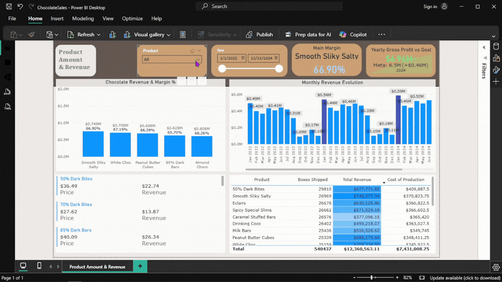
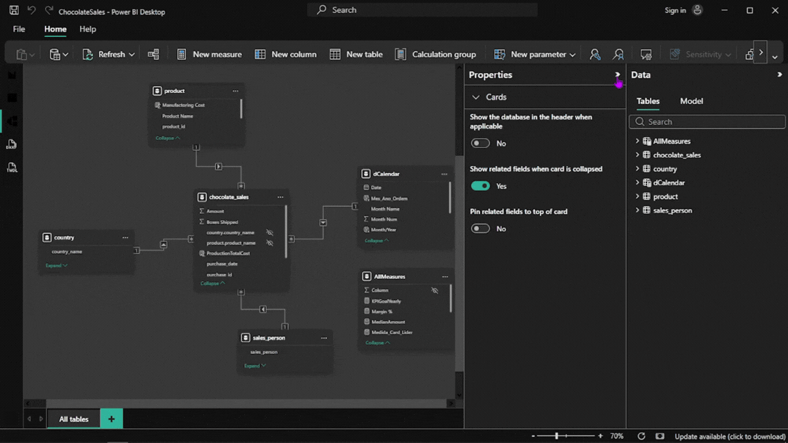

# Chocolate Sales Analytics Dashboard



An end-to-end Business Intelligence project analyzing chocolate sales performance, utilizing Python for data engineering, SQL Server for data warehousing, and Power BI for multidimensional modeling and predictive analytics.

---

## 🏗️ Data Architecture & Pipeline

```text
[Kaggle Excel Source] ➔ [Python/Pandas ETL] ➔ [SQL Server (SSMS)] ➔ [Power BI Star Schema]
```

1. **Extraction & Transformation (Python/Pandas):** 
   * Extracted raw multi-tab `.xlsx` datasets downloaded from Kaggle.
   * Developed Python scripts in VS Code using **Pandas** to isolate, clean, and export individual spreadsheets into structured `.csv` files.
2. **Data Warehousing (SQL Server & SSMS):**
   * Designed and deployed a relational database inside **SQL Server Management Services (SSMS)**.
   * Imported the structured CSVs to maintain data persistence, integrity, and enable optimized query extractions.
3. **Data Modeling (Star Schema):**
   * Structured a robust dimensional model within Power BI to optimize performance and cross-filtering integrity.



*   **Fact Table:** `ChocolateSales` (Transactions, quantities, and revenue data).
*   **Dimension Tables:** `Product`, `Country`, `Sales_Person`, and a dynamic `Calendar` table created via DAX.

---
## The Python Script

It's not something so advanced as it may seen. Mostly the code is simple because there's only one purpose:

```python
import pandas as pd

file_path = r'C:\Users\Isdras\Documents\My Dashboards\ChocolateSales\Chocolate Sales.xlsx'
all_sheets = pd.read_excel(file_path, sheet_name=None)

for sheet_name, df in all_sheets.items():
    # Check if Date exists 
    if 'purchase_date' in df.columns:
        date_data = df['purchase_date']
        print(f"Found Date column in {sheet_name}")
        df['purchase_date'] = pd.to_datetime(df['purchase_date'])
    
    # Save the CSV as you were doing
    df.to_csv(f'{sheet_name}.csv', index=False)
```

## 🎯 Technical & Business Highlights

### 1. Visualization & Storytelling
The dashboard layout follows an executive information hierarchy for rapid decision-making:
*   **Layer 1 (KPIs):** Macro views of **Total Amount**, **Profit**, and **Margin %** utilizing advanced DAX measures paired with target comparisons (Goal vs. Actual).
*   **Layer 2 (Deep Dive):** Conditional formatting to isolate performance metrics for the sales-leading product, and analyze of the product to determine if it's profitable to continue creating that through two differente fields (Price and Cost).
*   **Layer 3:** A list showing the cost and revenue for each chocolate, but in large scale, from the beginning of the company until now.

### 2. Advanced Analytics & Forecasting
*   You can see that in the bars indicator there's a different color in some bars I wanted to show that sometimes (roughly every January) we can pass our sale limits.

---

## 🛠️ Tools & Technologies Used

*   **Python (Pandas):** Programmatic ETL to split multi-sheet workbooks and clean raw data.
*   **SQL Server & SSMS:** Database creation, data warehousing management, and relational storage.
*   **Power Query:** Final stage data preparation, column typing, and schema staging.
*   **DAX (Data Analysis Expressions):** Authored complex business logic measures including `Margin %`, `Total Amount`, `Goal Variance`, and Time Intelligence functions.
*   **Power BI Desktop:** Star schema modeling, data visualization, and reporting.

---

## 👤 Developer
*   **Diogo Oliveira**
