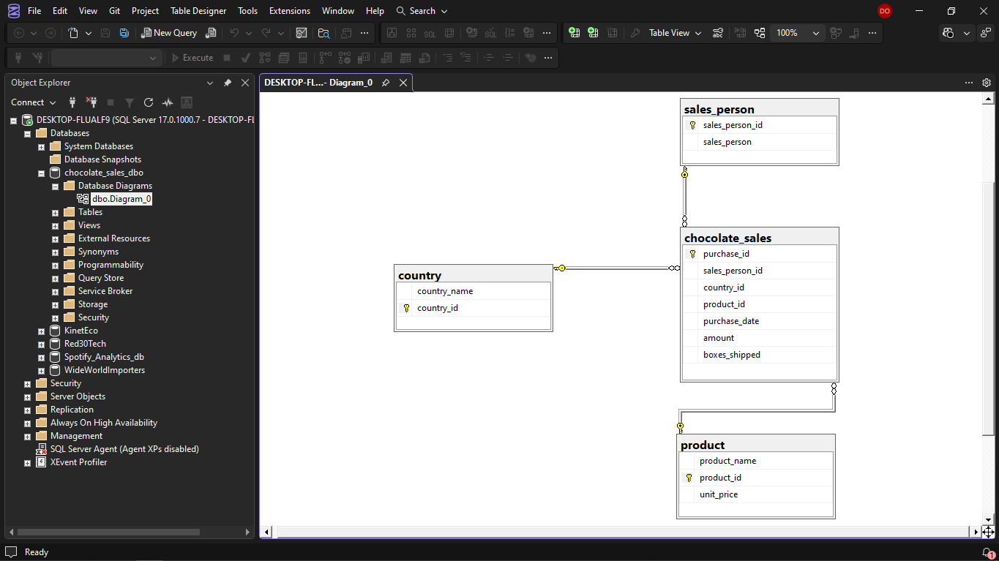

# Chocolate Sales Analytics Dashboard


An end-to-end Business Intelligence project analyzing chocolate sales performance, utilizing Python for data engineering, SQL Server for data warehousing, and Power BI for multidimensional modeling and predictive analytics.

---

## 🏗️ Data Architecture & Pipeline

```text
[Kaggle Excel Source] ➔ [Python/Pandas ETL] ➔ [SQL Server (SSMS)] ➔ [Power BI Star Schema]
```

1. **Extraction & Transformation (Python/Pandas):** 
   * Extracted raw multi-tab `.xlsx` datasets downloaded from Kaggle.
   * Developed Python scripts in VS Code using **Pandas** to isolate, clean, and export individual spreadsheets into structured `.csv` files.
2. **Data Warehousing (SQL Server & SSMS):**
   * Designed and deployed a relational database inside **SQL Server Management Services (SSMS)**.
   * Imported the structured CSVs to maintain data persistence, integrity, and enable optimized query extractions.



3. **Data Modeling (Star Schema):**
   * Structured a robust dimensional model within Power BI to optimize performance and cross-filtering integrity.


*   **Fact Table:** `ChocolateSales` (Transactions, quantities, and revenue data).
*   **Dimension Tables:** `Product`, `Country`, `Sales_Person`, and a dynamic `Calendar` table created via DAX.

---
## The Python Script

I created that script to run with anything, so, if you need to add multiples csv files inside a single table in a database, or if you want to add different csv files in different tables in a database, you can. The only problem is, the csv file must be the same name as the table:

```python
import pandas as pd
from sqlalchemy import create_engine
import urllib
import urllib.parse
import os

pasta = os.path.join('.', 'files')

def df_cleaner(df):
        df['purchase_date'] = pd.to_datetime(df['purchase_date'], format='mixed', errors='coerce')
        return df

# If you are going to test the pipeline, dont forget to change the parameters
def to_sql_loader(df, table_name):
    params = urllib.parse.quote_plus(
    'DRIVER={Usually is ODBC Driver 17 for SQL Server};'
    'SERVER=server_name;'
    'DATABASE=database_name;'
    'Trusted_Connection=yes;'
    'TrustServerCertificate=yes;'
)
    engine = create_engine(f"mssql+pyodbc:///?odbc_connect={params}")
    df.to_sql(table_name, con=engine, if_exists='append', index=False)
    return df

def main():
    for nome_arquivo in os.listdir(pasta):
        if nome_arquivo.endswith('.xlsx'):
            file_path = os.path.join(pasta, nome_arquivo)        
            all_sheets = pd.read_excel(file_path, sheet_name=None)
            for sheet_name, nome_arquivo in all_sheets.items():
                pipeline = (
                    nome_arquivo.pipe(df_cleaner)
                    .pipe(to_sql_loader, sheet_name)
                )

if __name__ == "__main__":
    main()
```
Now explaining the code in parts:

1. the first function works as a cleaner, since the xlsx file is already well cleaned I just change the way the column purchase_data will be assigned leaving for pandas to determine what is the format of the column by using the parameter format='mixed';
2. Then, the function to_sql_loader is where we define the parameters and engine to access the server, only then, it will insert the dataframe into the database;
3. Lastly, the main function is where all the work is done. It will get all the .xlsx inside the folder and transform all of them into csv files, clean them all, and only then send to the database. All that process is done specially because of the pipe() where it works as a pipeline already.

## 🎯 Technical & Business Highlights

### 1. Visualization & Storytelling
The dashboard layout follows an executive information hierarchy for rapid decision-making:
*   **Layer 1 (KPIs):** Macro views of **Total Amount**, **Profit**, and **Margin %** utilizing advanced DAX measures paired with target comparisons (Goal vs. Actual).
*   **Layer 2 (Deep Dive):** Conditional formatting to isolate performance metrics for the sales-leading product, and analyze of the product to determine if it's profitable to continue creating that through two differente fields (Price and Cost).
*   **Layer 3:** A list showing the cost and revenue for each chocolate, but in large scale, from the beginning of the company until now.

### 2. Advanced Analytics & Forecasting
*   You can see that in the bars indicator there's a different color in some bars I wanted to show that sometimes (roughly every January) we can pass our sale limits.

---

## 🛠️ Tools & Technologies Used

*   **Python (Pandas):** Programmatic ETL to split multi-sheet workbooks and clean raw data.
*   **SQL Server & SSMS:** Database creation, data warehousing management, and relational storage.
*   **Power Query:** Final stage data preparation, column typing, and schema staging.
*   **DAX (Data Analysis Expressions):** Authored complex business logic measures including `Margin %`, `Total Amount`, `Goal Variance`, and Time Intelligence functions.
*   **Power BI Desktop:** Star schema modeling, data visualization, and reporting.

---

## 👤 Developer
*   **Diogo Oliveira**
