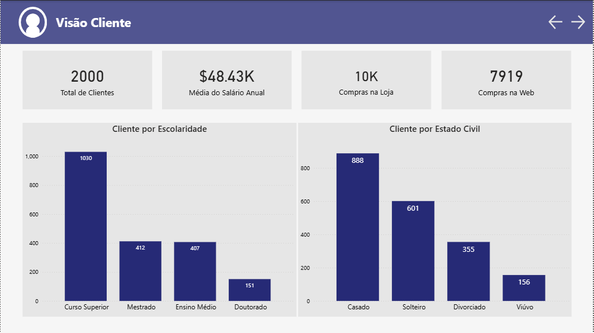
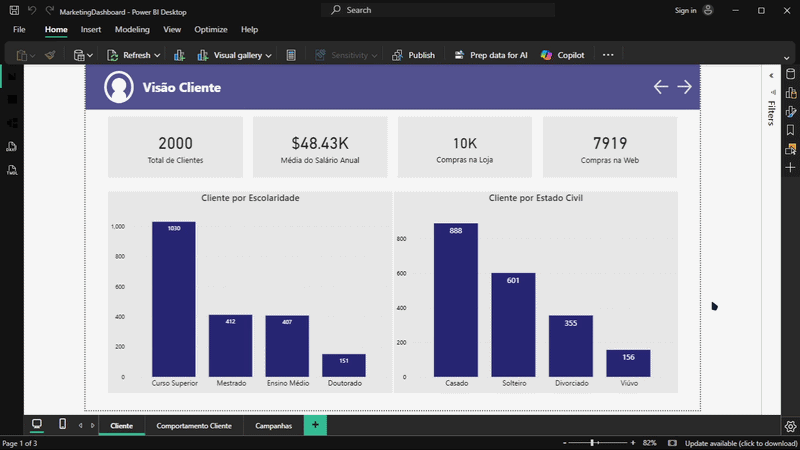
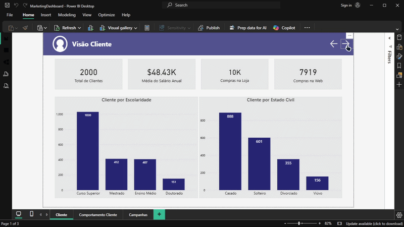
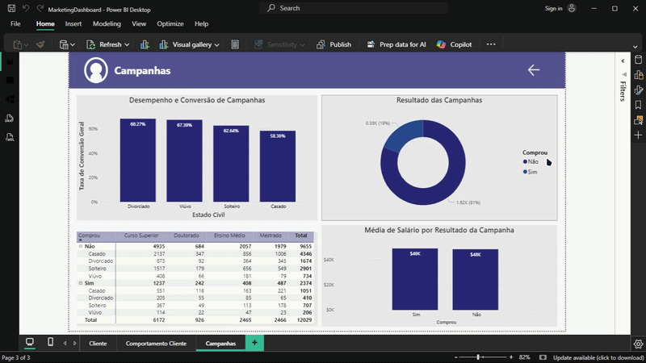

# Dashboard de Compliance Regulatório e Saneamento SRO (SUSEP)



Um projeto de Business Intelligence voltado para o setor de Marketing. O objetivo principal é analisar de como foi a recepção dos clientes pelas campanhas feitas, além disso, utilizando Big Query do Google Cloud para engenharia de qualidade de dados e Power BI para modelagem multidimensional (DAX).

---

## Arquitetura Utilizada

```text
[Big Query] ➔ [Script SQL para ter as colunas das campanhas] ➔ [Dashboard no Power BI]
```

## O Script SQL (Extração de Dados)

O Script em SQL foi feito para selecionar as colunas conforme mencionado anteriormente, e extraír somente aquilo que iria ser utilizado na análise:

```SQL
SELECT
ID,
Ano_Nascimento,
Escolaridade,
Estado_Civil,
Salario_Anual,
Filhos_Em_Casa,
Adolescentes_Em_Casa,
Data_Cadastro,
Dias_Desde_Ultima_Compra,
(Gastos_Eletronicos + Gastos_Brinquedos + Gastos_Moveis + Gastos_Utilidades + Gastos_Alimentos + Gastos_Vestuario) AS Gasto_Total_MKT,
Num_Compras_Desconto,
(Num_Compras_Web + Num_Compras_Catalogo + Num_Compras_Loja) AS Total_Compras,
Num_Visitas_Website_Mes,
-- Se você só precisa saber se o cliente aceitou alguma campanha (Sim/Não ou 1/0)
IF(Campanha1 + Campanha2 + Campanha3 + Campanha4 + Campanha5 > 0, 1, 0) AS Aceitou_Campanha,
Comprou
FROM

Marketing.Campaigns
```
Como foco em otimização e performance do dashboard eu acabei juntando as colunas de valores de Gastos Total, além disso, consolidei o total de compras por cliente com excessão de número de compras com desconto, e por fim, consolidei as colunas das campanhas em apenas uma (Aceitou_Canpanha).

---

## Destaques Técnicos & de Negócio

O layout do dashboard segue uma hierarquia de informação executiva:

## 1. Página 1: Visão Cliente



*   **Card Total de Clientes:** Monitora a nossa carteira atual de clientes contando todos os valores distintos.
*   **Card Média do Salário Anual:** Aqui nós podemos ver quanto em média nossos clientes ganham anualmente.
*   **Cards de Compras na Loja e Web:** Com esses Cards podemos monitorar como estamos de venda no e-commerce e em lojas físicas.
*   **Gráfico de Barras Escolaridade do Cliente:** Esse gráfico serve especificamente para sabermos sobre a escolaridade do cliente, dependendo podemos direcionar conteúdos com maiores valores e vice-versa.
*   **Gráfico de Barras por Estado Civil do Cliente:** Com esse gráfico podemos visualizar quais são os nossos clientes que mais compram de nós por estado civil, então, se for casado, podemos apresentar conteúdos com foco em relacionamento ou presentes, e até mesmo impulsionar mais nos dias dos namorados esses presentes sabendo que nossos clientes principais são casados.

---

## Página 2: Comportamento do Cliente



*   **Gráfico de Dispersão Total Gasto por Salário Anual:** Com esse gráfico podemos ver que os nossos clientes que mais gastam não necessariamente são os que mais ganham anualmente, além de poder saber que aqueles que mais gastam, nós podemos pegar esses clientes e preparar algum desconto.
*   **Gráficos de Barras Crianças e Adolescentes por Gasto Anual:** Ambos apresentam o mesmo interesse, entender se os gasto por cada criança e adolescente são maiores ou menores, eu não misturei os dados para apresentar como um só, porque os clientes podem ter crianças abaixo dos 14 anos como também podem ter adolescentes.

---

## Página 3: Auditoria e Saneamento de Dados



*   **Gráfico de Barras Desempenho de Conversão de Campanhas:** Com esse gráfico podemos ver o quanto por cento quais clientes clicaram nas nossas campanhas, mas isso não quer dizer que compraram. A fórmula utilizada foi a seguinte:


```DAX
Taxa de Conversão Geral = 
VAR TotalCompradores = 
    CALCULATE(
        COUNTA(MarketingData[Comprou]), 
        MarketingData[Comprou] = "Sim"
    )

RETURN
    DIVIDE(TotalCompradores, Gasto_Total_MKT, 0)

```

*   **Gráfico de Rosca Resultado das Campanhas:** Com esse gráfico de rosca podemos ver quantas pessoas compraram e quantas pessoas não compraram, assim podendo ver quais são os clientes que fizeram todo o processo.
*   **Tabela Compras dos Clientes:** Com essa tabela podemos ver quais foram os clientes que mais compraram, se eles são casados e qual o grau de estudos deles, e também ver aqueles que não compraram. Lembrando que não necessariamente aqueles que não compraram não foram afetados pela campanha.
*   **Gráfico de Barras Média de Salário por Resultado das Campanhas:** E por fim, nós podemos ver os clientes que compraram ou não a partir da média de salários.

---
## Ferramentas & Tecnologias Utilizadas

*   **Claude:** Foi utilizado o Claude para criação dos dados, utilizando da prática de engenharia de prompt.
*   **DAX (Data Analysis Expressions):** Criação de métricas de negócio complexas como `Taxa de Conversão Regulatória`.
*   **Power BI Desktop:** Modelagem de dados, engenharia de formatação condicional e visualização de dados.
*   **Google Cloud:** Todos os dados estão registrados na Nuvem.
---

## Desenvolvedor
*   **Diogo Oliveira**
